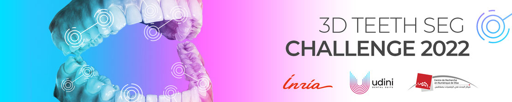
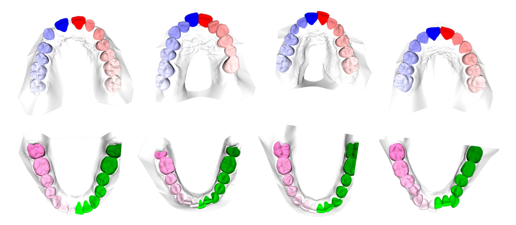
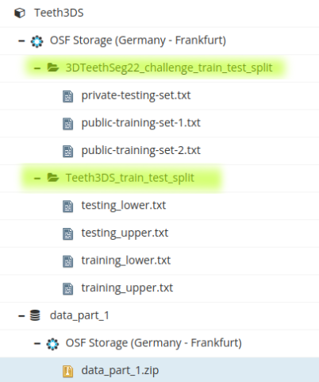

# 3D Teeth Scan Segmentation and Labeling Challenge

This repository contains an enhanced implementation of the 3DTeethSeg22 challenge, originally associated with MICCAI 2022 and organized by [Udini](https://www.udini.ai/) (France) in collaboration with [Inria Grenoble Morpheo team](https://team.inria.fr/morpheo/) (France) and the [Digital Research Center of Sfax](http://www.crns.rnrt.tn/) (Tunisia).

**Authors:** Livia Ellen & Vitoria Lara Soria

## Modifications and Enhancements

This implementation extends the original challenge framework with several key improvements:

### Enhanced Deep Learning Pipeline
- **PyTorch Integration**: Complete PyTorch-based training and inference pipeline
- **Multiple Model Architectures**: 
  - PointNet for basic point cloud segmentation
  - PointNet++ for hierarchical feature learning
  - Custom TeethSegmentationNet for multi-task learning
- **Advanced Data Loading**: Efficient data pipeline with augmentation support
- **Training Infrastructure**: Comprehensive trainer with validation, checkpointing, and logging

### Expanded Evaluation Framework
- **Additional Metrics**: Beyond the original TLA, TIR, and TSA metrics:
  - Precision and Recall components
  - IoU (Intersection over Union) scores
  - Dice coefficient calculations
  - Per-tooth detailed analysis
- **Enhanced Visualizations**: Interactive plotting and comparative analysis tools
- **Statistical Analysis**: Comprehensive performance breakdowns

### Improved Usability
- **Modular Architecture**: Clean separation of concerns with dedicated modules for training, evaluation, and visualization
- **Example Scripts**: Ready-to-use examples for training, inference, and evaluation
- **Documentation**: Comprehensive usage examples and API documentation
- **Flexible Configuration**: Easy-to-modify parameters for different experimental setups

## Description

### Overview
Computer-aided design (CAD) tools have become increasingly popular in modern dentistry for highly accurate treatment 
planning. In particular, in orthodontic CAD systems, advanced intraoral scanners (IOSs) are now widely used as they 
provide precise digital surface models of the dentition. Such models can dramatically help dentists simulate teeth 
extraction, move, deletion, and rearrangement and ease therefore the prediction of treatment outcomes. Hence, 
digital teeth models have the potential to release dentists from otherwise tedious and time consuming tasks.

### Problem Statement
Although IOSs are becoming widespread in clinical dental practice, there are only few contributions on teeth
segmentation/labeling available in the literature and no publicly available database. A fundamental issue that 
appears with IOS data is the ability to reliably segment and identify teeth in scanned observations. 
Teeth segmentation and labeling is difficult as a result of the inherent similarities between teeth shapes as well 
as their ambiguous positions on jaws.

### Technical Challenges

The 3D teeth segmentation task faces several technical challenges:

1. **Geometric Variability**: The teeth position and shape variation across subjects creates significant inter-patient variability.
2. **Dental Pathologies**: The presence of abnormalities in dentition, including:
   - Teeth crowding resulting in misalignment and non-explicit boundaries between neighboring teeth
   - Missing teeth and dental holes commonly observed in clinical practice
   - Damaged or restored teeth with altered morphology
3. **Clinical Hardware**: The presence of braces, retainers, and other orthodontic equipment that occlude tooth surfaces.
4. **Scanning Artifacts**: Noise, incomplete surfaces, and reconstruction artifacts from intraoral scanning.

### Methodology

#### Data Representation
- **Input**: 3D mesh data (.obj format) representing intraoral scans
- **Output**: Per-vertex labels using FDI (Fédération Dentaire Internationale) numbering system
- **Instance Segmentation**: Individual tooth identification with unique instance IDs

#### Evaluation Framework
The challenge employs three complementary metrics:

1. **Teeth Localization Accuracy (TLA)**: 
   - Measures normalized Euclidean distance between GT and predicted centroids
   - Accounts for tooth size variation through normalization
   - Penalty of 5× tooth size for missing detections

2. **Teeth Identification Rate (TIR)**:
   - Percentage of correctly identified teeth (position + label)
   - Requires distance < 0.5× tooth size and correct FDI label

3. **Teeth Segmentation Accuracy (TSA)**:
   - F1-score over all tooth point clouds
   - Measures segmentation quality at vertex level

#### Enhanced Metrics (This Implementation)
- **Precision/Recall**: Individual performance components
- **IoU (Intersection over Union)**: Jaccard index for segmentation overlap
- **Dice Coefficient**: Harmonic mean of precision and recall
- **Per-Tooth Analysis**: Individual tooth performance metrics

The challenge focuses primarily on geometric variability across subjects, with plans to address additional challenges in future iterations as the dataset expands.


## Citing us

```
@article{ben20233dteethseg,
title={3DTeethSeg'22: 3D Teeth Scan Segmentation and Labeling Challenge},
author={Achraf Ben-Hamadou and Oussama Smaoui and Ahmed Rekik and Sergi Pujades and Edmond Boyer and Hoyeon Lim and Minchang Kim and Minkyung Lee and Minyoung Chung and Yeong-Gil Shin and Mathieu Leclercq and Lucia Cevidanes and Juan Carlos Prieto and Shaojie Zhuang and Guangshun Wei and Zhiming Cui and Yuanfeng Zhou and Tudor Dascalu and Bulat Ibragimov and Tae-Hoon Yong and Hong-Gi Ahn and Wan Kim and Jae-Hwan Han and Byungsun Choi and Niels van Nistelrooij and Steven Kempers and Shankeeth Vinayahalingam and Julien Strippoli and Aurélien Thollot and Hugo Setbon and Cyril Trosset and Edouard Ladroit},
journal={arXiv preprint arXiv:2305.18277},
year={2023}
}

@article{ben2022teeth3ds,
title={Teeth3DS: a benchmark for teeth segmentation and labeling from intra-oral 3D scans},
author={Ben-Hamadou, Achraf and Smaoui, Oussama and Chaabouni-Chouayakh, Houda and Rekik, Ahmed and Pujades, Sergi and Boyer, Edmond and Strippoli, Julien and Thollot, Aur{\'e}lien and Setbon, Hugo and Trosset, Cyril and others},
journal={arXiv preprint arXiv:2210.06094},
year={2022}
}
```

## Dataset details
### License

The data is provided under the [CC BY-NC-ND 4.0 License](https://creativecommons.org/licenses/by-nc-nd/4.0/)

### Data
A total of 1800 3D intra-oral scans have been collected for 900 patients covering their upper and lower jaws separately. 

The ground truth tooth labels and tooth instances for each vertex in the obj
files are provided in JavaScript Object Notation (JSON) format. A JSON file
example is shown below:
```python
{
    "id_patient": "6X24ILNE", 
    "jaw": "upper",
    "labels": [0, 0, 44, 33, 34, 0, 0, 45, 0, .. ,41,  0, 0, 37, 0, 34, 45, 0, 31, 36], 
    "instances": [0, 0, 10, 2, 12, 0, 0, 9, 0, 0, .. , 10, 0, 0, 8, 0, 0, 9, 0, 1, 8, 13],
}
```
The length of the tables ”labels” and ”instances” is the same as the total number of vertices in the corresponding 3D scan. The label and instance ”0” are
reserved by default for gingiva. And, other than ”0”, the unique numbers in table ”instances” indicate the number of teeth in the 3D scan.

The labels are provided in the FDI numbering system.


### Download

Dataset is structured under 6 data parts. It is required to download all of them and merge them to a same folder architecture.
1. url : https://osf.io/xctdy/

Two dataset train/test splits are provided , which specify the samples to consider for each dataset:
* 3D Teeth Seg Challenge split (used during the challenge)
* Teeth3DS official dataset split




## Evaluation
### Metrics
* Teeth localization accuracy (TLA):

calculated as the mean of normalized Euclidean distance between ground truth (GT) teeth centroids and the closest localized teeth centroid. 
Each computed Euclidean distance is normalized by the size of the corresponding GT tooth. 
In case of no centroid (e.g. algorithm crashes or missing output for a given scan) a nominal penalty of 5 per GT tooth 
will be given. This corresponds to a distance 5 times the actual GT tooth size. As the number of teeth per patient may
be variable, here the mean is computed over all gathered GT Teeth in the two testing sets.

* Teeth identification rate (TIR): 

is computed as the percentage of true identification cases relatively to all GT teeth in the two testing sets. A true identification is considered when for a given GT Tooth, the closest detected tooth centroid : is localized at a distance under half of the GT tooth size, and is attributed the same label as the GT tooth
* Teeth segmentation accuracy (TSA): 

is computed as the average F1-score over all instances of teeth point clouds. 
The F1-score of each tooth instance is measured as:
F1=2*(precision * recall)/(precision+recall)

**📌 NOTE:** Metrics calculation scripts are gathered in [evaluation.py](evaluation/evaluation.py)

### Implementation Details

#### Algorithm Pipeline
1. **Preprocessing**: Mesh normalization and cleaning
2. **Feature Extraction**: Geometric feature computation (curvature, normals, etc.)
3. **Segmentation**: Deep learning-based vertex classification
4. **Post-processing**: Instance refinement and label consistency

#### Requirements
```bash
# Install PyTorch (choose appropriate version for your system)
pip install torch torchvision torchaudio

# Install additional dependencies
pip install -r requirements.txt

# Or install manually:
pip install trimesh numpy scikit-learn scipy matplotlib plotly seaborn pandas
pip install torch-geometric pytorch3d open3d tensorboard wandb
```

#### PyTorch Models Available
- **PointNet**: Classic point cloud segmentation network
- **PointNet++**: Hierarchical feature learning with set abstraction
- **Custom TeethSegmentationNet**: Multi-task model for simultaneous segmentation and instance prediction

#### Usage Examples

##### 1. Evaluation Only
```python
from evaluation.evaluation import calculate_metrics
from visualization.visualize_results import TeethVisualization

# Load data and run evaluation
jaw_TLA, jaw_TSA, jaw_TIR, precision, recall, iou, dice, per_tooth_metrics = calculate_metrics(gt_data, pred_data)

# Visualize results
viz = TeethVisualization()
fig = viz.plot_metrics_comparison({
    'TSA': jaw_TSA, 'TLA': jaw_TLA, 'TIR': jaw_TIR,
    'precision': precision, 'recall': recall, 'iou': iou, 'dice': dice
})
```

##### 2. PyTorch Training
```python
from training.trainer import TeethSegmentationTrainer
from data.pytorch_dataset import TeethSegmentationDataModule
import torch

# Setup data
data_module = TeethSegmentationDataModule(
    data_dir="path/to/data",
    batch_size=16,
    num_points=2048
)
data_module.setup()

# Initialize trainer
trainer = TeethSegmentationTrainer(
    model_name='custom',  # or 'pointnet'
    num_classes=49,
    learning_rate=0.001,
    device=torch.device('cuda' if torch.cuda.is_available() else 'cpu')
)

# Train model
trainer.train(
    train_loader=data_module.train_dataloader(),
    val_loader=data_module.val_dataloader(),
    num_epochs=100
)
```

##### 3. PyTorch Inference
```python
from examples.example_algorithm import PyTorchSegmentationAlgorithm

# Initialize algorithm with pre-trained model
algorithm = PyTorchSegmentationAlgorithm(
    model_name='custom',
    model_path='checkpoints/best_model.pth',
    num_points=2048
)

# Run inference
labels, instances = algorithm.process('path/to/scan.obj')
```

## References

### Core Papers

1. **Ben-Hamadou, A., et al.** (2023). "3DTeethSeg'22: 3D Teeth Scan Segmentation and Labeling Challenge." *arXiv preprint arXiv:2305.18277*.

2. **Ben-Hamadou, A., et al.** (2022). "Teeth3DS: a benchmark for teeth segmentation and labeling from intra-oral 3D scans." *arXiv preprint arXiv:2210.06094*.

### Related Work in 3D Teeth Segmentation

#### Deep Learning Approaches
3. **Cui, Z., et al.** (2021). "TSegNet: An efficient and accurate tooth segmentation network on 3D dental model." *Medical Image Analysis*, 69, 101949.

4. **Lian, C., et al.** (2020). "Deep multi-scale mesh feature learning for automated labeling of raw dental surfaces from 3D intraoral scanners." *IEEE Transactions on Medical Imaging*, 39(7), 2440-2450.

5. **Xu, X., et al.** (2019). "3D tooth segmentation and labeling using deep convolutional neural networks." *IEEE Transactions on Visualization and Computer Graphics*, 25(7), 2336-2348.

#### Traditional Methods
6. **Kronfeld, T., et al.** (2010). "Snake-based segmentation of teeth from virtual dental casts." *Computer-Aided Design and Applications*, 7(2), 221-233.

7. **Kondo, T., et al.** (2004). "Tooth segmentation of dental study models using range images." *IEEE Transactions on Medical Imaging*, 23(3), 350-362.

### 3D Medical Image Segmentation
8. **Çiçek, Ö., et al.** (2016). "3D U-Net: learning dense volumetric segmentation from sparse annotation." *International Conference on Medical Image Computing and Computer-Assisted Intervention*, 424-432.

9. **Milletari, F., et al.** (2016). "V-Net: Fully convolutional neural networks for volumetric medical image segmentation." *2016 fourth international conference on 3D vision (3DV)*, 565-571.

### Point Cloud Processing
10. **Qi, C. R., et al.** (2017). "PointNet: Deep learning on point sets for 3D classification and segmentation." *Proceedings of the IEEE conference on computer vision and pattern recognition*, 652-660.

11. **Qi, C. R., et al.** (2017). "PointNet++: Deep hierarchical feature learning on point sets in a metric space." *Advances in neural information processing systems*, 30.

### Mesh-Based Methods
12. **Hanocka, R., et al.** (2019). "MeshCNN: a network with an edge." *ACM Transactions on Graphics*, 38(4), 1-12.

13. **Feng, Y., et al.** (2019). "MeshNet: Mesh neural network for 3D shape representation." *Proceedings of the AAAI Conference on Artificial Intelligence*, 33(01), 8279-8286.

### Evaluation Metrics
14. **Taha, A. A., & Hanbury, A.** (2015). "Metrics for evaluating 3D medical image segmentation: analysis, selection, and tool." *BMC medical imaging*, 15(1), 1-28.

15. **Yeghiazaryan, V., & Voiculescu, I.** (2018). "Family of boundary overlap metrics for the evaluation of medical image segmentation." *Journal of Medical Imaging*, 5(1), 015006.

### Clinical Applications
16. **Flügge, T. V., et al.** (2017). "Registration of cone beam computed tomography data and intraoral surface scans–a prerequisite for guided implant surgery with CAD/CAM drilling guides." *Clinical Oral Implants Research*, 28(9), 1113-1118.

17. **Ender, A., & Mehl, A.** (2011). "Full arch scans: conventional versus digital impressions—an in-vitro study." *International Journal of Prosthodontics*, 24(1).

### Survey Papers
18. **Chen, L., et al.** (2021). "A survey on 3D medical image analysis with deep learning." *Medical Image Analysis*, 71, 102035.

19. **Bria, A., et al.** (2020). "An effective deep learning approach for automatic kidneys segmentation in CT images." *IEEE Access*, 8, 155242-155254.

### Datasets and Benchmarks
20. **Antonelli, M., et al.** (2022). "The Medical Segmentation Decathlon." *Nature Communications*, 13(1), 4128.

## License 
The rest of this repository is under the [MIT License](https://choosealicense.com/licenses/mit/).

## Contact
For queries and issues not fit for a github issue, please email [Achraf Ben Hamadou](mailto:achraf.benhamadou@crns.rnrt.tn) .

